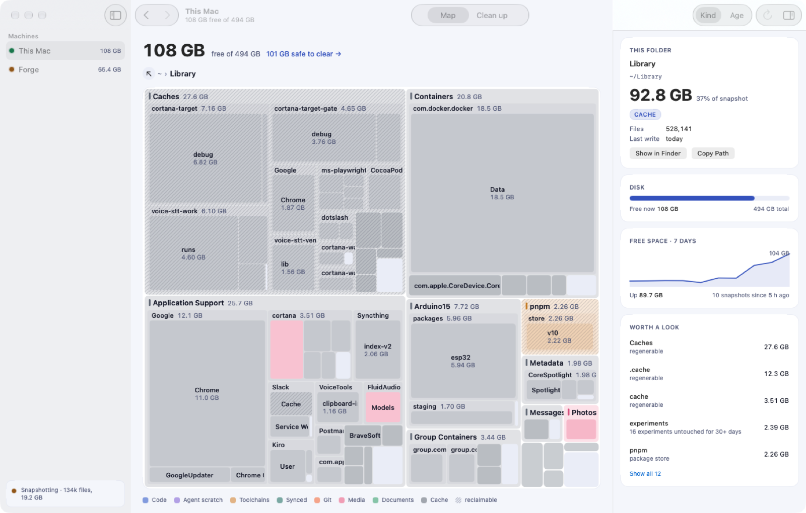
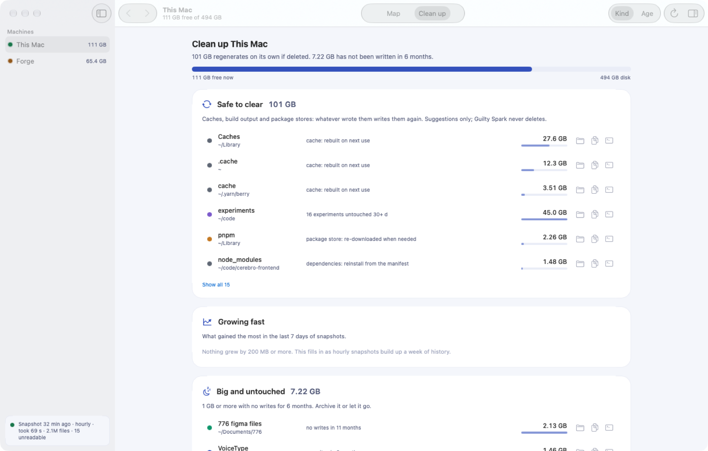

# Guilty Spark (work name: `disk`)

> **Hard rule (Asif, 2026-09-24): Guilty Spark never deletes anything. It only suggests.** No
> endpoint, button, key or menu item may remove, trash or move a file. Suggestions offer Show in
> Finder and Copy Path; the delete happens outside the tool. The UI harness asks the server for
> `remove`, `plan`, `removal`, `delete` and `trash` and fails unless each is a 404.

This fork of [tobi/disktree](https://github.com/tobi/disktree) adds hourly disk snapshots on macOS and a
browser UI in Cortana's visual language. The UI shows every machine from one page. Today that is the
laptop and the Forge box (`mac-server`).

Upstream's crates (`disktree-core`, `disktree-app`) keep their names so upstream merges stay clean.
Our additions:

| Piece | What it does |
|---|---|
| `crates/disk-web/src/bin/disk-snap.rs` | Scans `$HOME` one time, writes one snapshot, then exits. launchd runs it every hour. It has no network and no delete. It is the **only** process that needs Full Disk Access. |
| `crates/disk-web/src/main.rs` | The UI and API. It reads the DB and never scans. It proxies peers under `/api/h/<id>/`, so the browser never sees a peer's token. |
| `crates/disk-web/src/store.rs` | The SQLite schema and the pruned-tree codec. |
| `apps/mac/` | The native Mac app (SwiftUI, Canvas treemap). It holds no grant. |
| `packaging/macos/{sign,install}.sh` | Signs both binaries, then installs the two agents. |
| core: `ScanOptions::exclude`, `ScanOptions::fold_below`, `classify::MARKER_FILES` | `exclude` lists a directory without opening it. `fold_below` sums small files and small directory subtrees into one leaf (snapper peak 923 MB → 146 MB, totals exact), never folding the files classification reads (`Cargo.toml`, `package.json`, `HEAD`). |





## Using the app

- **Map:** click a folder to go in; Back/Forward (⌘[ ⌘], Esc), Enclosing Folder (⌘↑, ⌫), or any
  part of the path to come out. Right-click a tile for Open, Inspect, Show in Finder, Copy Path, and
  **Copy Delete Command**: a command for you to paste. It is the owner's cleanup for a known cache
  (`npm cache clean --force`, `uv cache clean`, …) and otherwise `trash '<path>'` (recoverable); `rm -rf`
  is a separate, labelled item. The app itself still never deletes.
  Colour by kind of data or by last write (Age). Hatching marks space that regenerates.
- **Clean up (⌘2):** four ranked lists, each item with the reason and size. Suggestions only.
- **Menu bar:** free space on every machine, and "Snapshot now".
- Launch arguments (for screenshots and tests, never keystrokes): `-page "Clean up"`,
  `-openPath <dir>`, `-appearance dark|light`, `-server <url>`.

## UI harness

`apps/mac/harness/run.sh` runs a second copy of the app that drives itself (`-harness YES`) through
launch, click in/back/forward/up, Age colours, Clean up, every peer machine, dark mode and window
sizes down to (and below) the minimum. It checks state after each step, asserts the server has no
delete endpoint, measures memory (budget 150 MB), and takes window-only screenshots. `DISK_APP=<binary>`
tests a build before installing. Bugs it found are listed in the commit history; the worst was an
intermittent crash on resize inside the system `.inspector` column, now a plain panel.

## Verifying these claims

Every claim here has a command. A claim whose check has not been run reads UNVERIFIED, never ✅.

| Claim | Check | Last result |
|---|---|---|
| Nothing can delete | `cargo test -p disk-web no_route` (routes answer 404 for remove, plan, removal, delete, trash, move, cleanup; any method). The UI harness also asks the live server. | pass 2026-09-24. Shown to fail: with a fake `remove` route it failed ("POST remove answered 200"). |
| Totals are exact with folding | `cargo test -p disktree-core folding` | pass 2026-09-24, 3 tests |
| Folding keeps build output and `node_modules` recognisable | `cargo test -p disktree-core folding_keeps` | pass. Shown to fail without the fix. |
| Growing fast names the directory, not its parents; Came back finds refills only; history thins after 14 days | `cargo test -p disk-web store::` | pass 2026-09-24, 7 tests |
| The app works end to end, including resizing below the minimum | `apps/mac/harness/run.sh` (20+ checks, screenshots) | soak: 15/15 clean, no crash reports (2026-09-24); 18 in a row since the inspector fix, 9 of 9 crashed before it |
| The app stays under 150 MB | same harness | 76–79 MB in the soak |
| Snapper peak memory | `/usr/bin/time -l ~/.local/bin/disk-snap --dir /tmp/x` | 146 MB, 2.9M files, 19 s (2026-09-24) |
| Snapshots run hourly on both machines | `sqlite3 ~/Library/Application\ Support/disk/disk.db "select datetime(taken_at,'unixepoch','localtime') from snapshots"` | hourly since 16:32 (laptop) and 16:45 (Forge), 2026-09-24. One laptop run took 40 min at load 138; launchd skips an hour rather than overlap. |
| Full Disk Access survives rebuilds | `launchctl submit -l probe -- ~/.local/bin/disk-snap --probe` | true on both, after 4 rebuilds (2026-09-24) |
| Browser page works on desktop and phone, read-only | `PLAYWRIGHT=… node crates/disk-web/web-check.mjs` | 13/13 pass (2026-09-24) |
| Growing fast and Came back are useful on real data | the week check: `curl -s 127.0.0.1:7321/api/h/local/suggest` after 7 days of snapshots | UNVERIFIED (needs history until 2026-10-01) |
| Strict lints | `cargo clippy -p disk-web -p disktree-core --all-targets -- -D warnings` | 0 findings (2026-09-24). The upstream GPUI app was not built here (Linux only). |

## Where the data is

`~/Library/Application Support/disk/disk.db` is on each machine. It is not synced (two writers on one
Syncthing file lose writes).

- `snapshots`: one row per run, kept forever. It holds volume free space, totals, the Full Disk Access state and what was skipped.
- `dirs`: each directory ≥ 100 MB, and every directory ≤ 2 levels deep, per run. Hourly rows stay for 14 days. After that, one run per day stays.
- `trees`: the pruned tree the treemap draws. Only the latest 2 are kept.

```
sqlite3 ~/Library/Application\ Support/disk/disk.db \
  "select datetime(taken_at,'unixepoch','localtime'), vol_available/1e9 from snapshots order by id desc limit 24"
```

## Why a separate snapper (the tcc-snapshot pattern)

TCC gives a permission to the *responsible process*. A launchd agent is its own responsible process,
so it can hold its own grant. `tccsnap` itself cannot do this job: it copies a compiled-in list of
files. If it ran other binaries, its allowlist would stop meaning anything. So `disk-snap` copies the
pattern instead: its own agent, a narrow job, and one grant.

Both binaries are signed with the Apple Development identity. The designated requirement is then
"this identifier and this signer", so **a rebuild keeps the grant**. An ad-hoc signature is a hash,
so every build would lose the grant without any warning.

Without the grant, the snapper still runs. It lists Desktop, Documents, Downloads, Pictures, Movies,
Music, iCloud and app containers, but does not open them, and it records the snapshot as partial. The
UI then shows a banner that names the skipped folders. Opening one of those folders is what raises a
consent dialog, one per folder, every hour. The probe (`~/Library/Safari`, `~/Library/Mail`) is
denied silently, without a dialog.

## Grant Full Disk Access (one time, per machine)

System Settings → Privacy & Security → Full Disk Access → **+** → `~/.local/bin/disk-snap`.
On Forge, do this through Screen Sharing. To check the grant: `launchctl kickstart gui/$(id -u)/com.asif.disk-snap`,
then look at `~/Library/Logs/com.asif.disk-snap.log`. A run with the grant does **not** end in
"partial (no Full Disk Access)".

## Install / update

```
cargo build --release -p disk-web && sh packaging/macos/sign.sh
DISK_LABEL="This Mac" sh packaging/macos/install.sh local \
  "forge=http://<forge-tailscale-ip>:7321,Forge,$HOME/Library/Application Support/disk/forge.token"
scp target/release/disk-{web,snap} packaging/macos/install.sh mac-server:/tmp/disk-install/
ssh mac-server 'DISK_LABEL=Forge sh /tmp/disk-install/install.sh remote <forge-tailscale-ip>:7321'
```

The UI is the Mac app: `apps/mac/build-app.sh` builds, signs and installs `~/Applications/Guilty Spark.app`. It is native SwiftUI over the same API, with a menu-bar readout of free space. The browser page at http://127.0.0.1:7321 still works (a phone, a machine without the app).

The app uses Cortana's `Theme` names and a verbatim copy of its generated tokens (`apps/mac/Sources/Tokens.swift`), so its views can move into Cortana's Mac client later.

## Safety

- The laptop server binds only to loopback. It refuses a `Host` header that is not loopback (DNS rebinding).
- Each POST must carry an `X-Disk` header, so another site's page cannot post to it without a CORS preflight, and nothing answers one.
- Forge binds only to its Tailscale IP and requires `X-Disk-Token` on every API call. The token file is 0600 on Forge, and a copy sits on the laptop.
- Nothing deletes. The server's only POST is `scan` (take a snapshot now); the harness fails if a delete endpoint appears.
